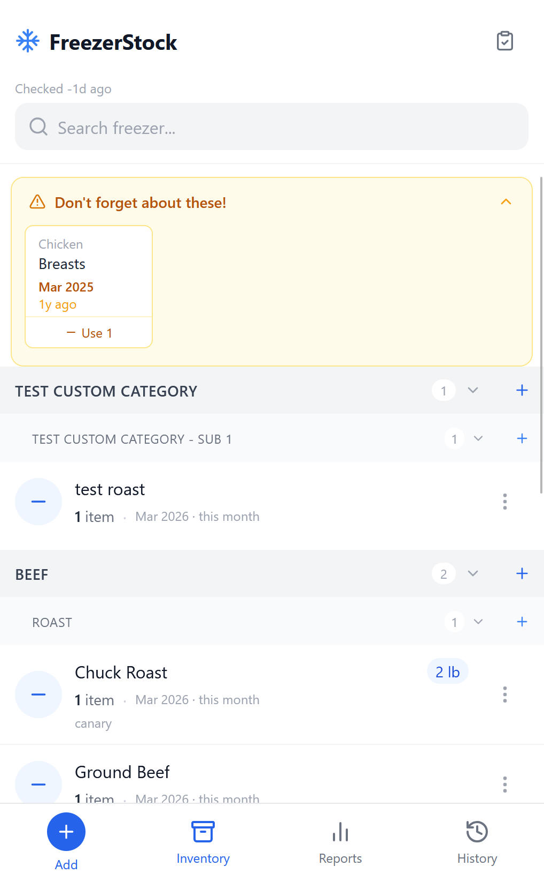
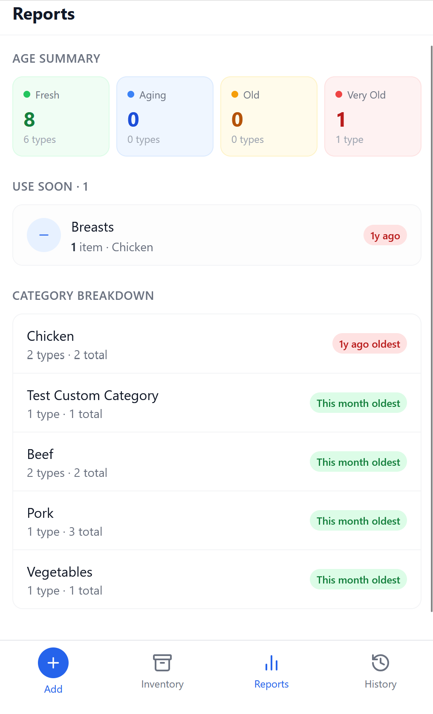
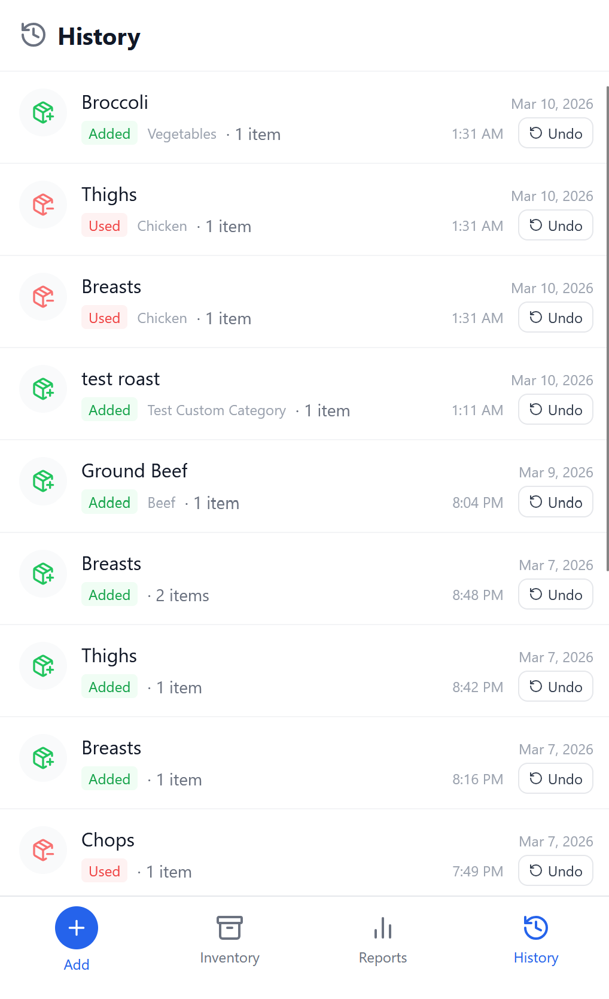

# FreezerStock

A mobile-first web app for managing your household freezer inventory. Track what's in your freezer, see how long items have been stored, and use items with a single tap.

## Screenshots

### Inventory



### Reports



### History



## Features

- **Inventory** — Browse items grouped by category (Beef, Chicken, Pork, etc.), search by name, and see frozen dates at a glance
- **Subcategories** — Organize within categories (for example Beef -> Steak/Roast) and create custom subcategories as needed
- **Quick-use** — Decrement item quantity in one tap; items are removed automatically when quantity hits zero
- **Age tracking** — Frozen date stored by month; color-coded display shows freshness (gray → amber → red as items age)
- **Aging alerts** — Banner and Reports page highlight items 6+ months old sorted by oldest first
- **History & undo** — All adds and uses are logged; undo within seconds via toast notification or any time from the History tab
- **Custom categories/subcategories** — Add top-level categories and optional subcategories directly from the Add Item flow
- **Inventory checks** — Run freezer audits, mark seen items, and remove missing items in a guided check flow
- **Realtime sync** — Open clients stay in sync through websocket change broadcasts

## Tech Stack

| Layer | Technology |
|---|---|
| Frontend | React 18, Vite, TanStack Query, React Router, Tailwind CSS, vite-plugin-pwa |
| Backend | Node.js, Express, Drizzle ORM |
| Database | SQLite via `@libsql/client` |
| Deployment | Docker + Docker Compose, Nginx |

## Getting Started

### Docker (recommended)

```bash
docker-compose up --build
```

Frontend: http://localhost:3000

The SQLite database is persisted in a named Docker volume (`freezerstock-data`).

### Local development

**Backend:**
```bash
cd backend && npm install && npm run dev
```

**Frontend:**
```bash
cd frontend && npm install && npm run dev
```

> Note: `vite.config.ts` proxies `/api` to the backend using the Docker hostname. For local-only development, update the proxy target in `vite.config.ts` to point to `localhost`.

### Build

```bash
cd backend && npm run build    # tsc → dist/
cd frontend && npm run build   # tsc + vite → dist/
```

## Project Structure

```
freezerstock/
├── backend/
│   └── src/
│       ├── index.ts              # Express app, mounts routers
│       ├── db/
│       │   ├── migrate.ts        # DB connection + CREATE TABLE migrations
│       │   ├── schema.ts         # Drizzle table definitions
│       │   └── seed.ts           # Default categories, subcategories, and item types
│       └── routes/
│           ├── items.ts          # CRUD and quick-use actions
│           ├── categories.ts     # Categories, subcategories, and item types
│           ├── history.ts        # History log and restore
│           └── inventoryChecks.ts # Inventory audit flow
├── frontend/
│   └── src/
│       ├── App.tsx               # Router + bottom tab navigation
│       ├── api/index.ts          # Centralized API client
│       ├── types/index.ts        # Shared TypeScript interfaces
│       ├── pages/
│       │   ├── InventoryPage.tsx
│       │   ├── ReportsPage.tsx
│       │   └── HistoryPage.tsx
│       └── components/
│           ├── AddItemModal.tsx
│           ├── EditItemModal.tsx
│           ├── ItemRow.tsx
│           ├── CategoryGroup.tsx
│           ├── FrozenAgo.tsx
│           ├── AgingBanner.tsx
│           └── UseToast.tsx
└── docker-compose.yml
```

## Data Model

- **`frozenDate`** is stored as `YYYY-MM` text. Age is always calculated client-side — never in SQL.
- **Item identity**: Items are either *typed* (linked to a predefined `item_type`) or *custom* (free-text name). `displayName = customName || itemType.name`.
- **History entries** store a full JSON snapshot of the item so that fully-consumed items can be restored.

## API Endpoints

| Method | Path | Description |
|---|---|---|
| GET | `/api/items` | List items (optional `?search=`) |
| POST | `/api/items` | Add item |
| PATCH | `/api/items/:id` | Edit item |
| DELETE | `/api/items/:id` | Delete item |
| POST | `/api/items/:id/use` | Decrement quantity |
| GET | `/api/categories` | List categories with item types |
| POST | `/api/categories` | Create top-level category |
| POST | `/api/subcategories` | Create subcategory under a category |
| POST | `/api/item-types` | Create item type (top-level or under subcategory) |
| GET | `/api/history` | Activity log |
| POST | `/api/history/:id/restore` | Undo an action |
| GET | `/api/inventory-checks/latest` | Most recent inventory check summary |
| POST | `/api/inventory-checks/start` | Start inventory check and return current items |
| POST | `/api/inventory-checks/complete` | Finalize check and remove marked missing items |

## Configuration

| Variable | Default | Description |
|---|---|---|
| `FRONTEND_PORT` | `3000` | Host port for the frontend container |
| `DATABASE_PATH` | `/app/data/freezerstock.db` | SQLite file path |
